# RX (Research Transformation) 技術仕様書

## 1. 概要

RX は、研究ライフサイクル全体を AI で支援するデスクトップアプリケーションである。文献探索、リサーチクエスチョンの策定、仮説生成、実験設計、データ分析、論文執筆に至るまで、研究の全フェーズをプロジェクト単位で一元管理する。

- **バージョン**: 0.1.0
- **アプリケーションID**: `com.rx.research-transformation`
- **製品名**: Research Transformation

---

## 2. アーキテクチャ

### 2.1 プロセス構成

Electron の標準的な3プロセスアーキテクチャを採用する。

```
┌─────────────────────────────────────────────────┐
│                 Main Process                     │
│  (Electron / Node.js)                           │
│  ┌──────────┐ ┌────────┐ ┌──────────────────┐  │
│  │ Database  │ │  LLM   │ │ Literature API   │  │
│  │ (SQLite)  │ │Service │ │    Service       │  │
│  └──────────┘ └────────┘ └──────────────────┘  │
│  ┌──────────────┐ ┌────────────┐ ┌──────────┐  │
│  │  Statistics   │ │ Document   │ │ Workflow │  │
│  │   Service    │ │ Generator  │ │  Engine  │  │
│  └──────────────┘ └────────────┘ └──────────┘  │
│              ▲ IPC (invoke/handle) ▲            │
├──────────────┼─────────────────────┼────────────┤
│              │   Preload Script    │            │
│              │ (Context Bridge)    │            │
├──────────────┼─────────────────────┼────────────┤
│              ▼                     ▼            │
│                Renderer Process                  │
│  (React 19 + TypeScript + Tailwind CSS)         │
│  ┌──────────┐ ┌────────┐ ┌──────────────────┐  │
│  │  Stores  │ │ Skills │ │   UI Components  │  │
│  │(Zustand) │ │(15個)  │ │  (Radix UI等)    │  │
│  └──────────┘ └────────┘ └──────────────────┘  │
└─────────────────────────────────────────────────┘
```

### 2.2 通信方式

Renderer から Main への通信は Electron の `ipcRenderer.invoke` / `ipcMain.handle` パターンを使用する。Preload スクリプトが `contextBridge.exposeInMainWorld` で `window.api` オブジェクトを公開し、型安全な IPC 通信を実現する。

- `nodeIntegration: false`
- `contextIsolation: true`
- `sandbox: false` (better-sqlite3 のネイティブモジュール要件)

---

## 3. 技術スタック

### 3.1 フロントエンド (Renderer Process)

| カテゴリ | ライブラリ | バージョン | 用途 |
|---------|-----------|-----------|------|
| UIフレームワーク | React | ^19.0.0 | コンポーネントベースUI |
| 状態管理 | Zustand | ^5.0.3 | クライアント状態管理 |
| ルーティング | react-router-dom | ^7.1.1 | ページ遷移 |
| UIコンポーネント | Radix UI | 各 ^1-2.x | アクセシブルなプリミティブ |
| スタイリング | Tailwind CSS | ^3.4.17 | ユーティリティファーストCSS |
| リッチテキスト | TipTap | ^3.20.0 | 学術論文エディタ |
| ビジュアルキャンバス | @xyflow/react | ^12.4.4 | ノード&エッジグラフ |
| テーブル | @tanstack/react-table | ^8.20.6 | データテーブル |
| チャート | Recharts | ^2.15.0 | データ可視化 |
| ガントチャート | frappe-gantt | ^0.6.1 | タイムライン管理 |
| 数式表示 | KaTeX | ^0.16.11 | 数学記法レンダリング |
| D&D | @dnd-kit | core ^6.3.1 | ドラッグ&ドロップ |
| アイコン | lucide-react | ^0.468.0 | アイコンセット |
| コマンドパレット | cmdk | ^1.0.4 | Cmd+K 操作 |
| パネルリサイズ | react-resizable-panels | ^2.1.7 | リサイザブルレイアウト |

### 3.2 バックエンド (Main Process)

| カテゴリ | ライブラリ | バージョン | 用途 |
|---------|-----------|-----------|------|
| デスクトップフレームワーク | Electron | ^33.3.1 | クロスプラットフォームデスクトップ |
| データベース | better-sqlite3 | ^11.7.0 | SQLite バインディング |
| ORM | drizzle-orm | ^0.38.4 | 型安全DBクエリ |
| AI API | openai | ^4.77.0 | OpenAI API クライアント |
| Word文書 | docx | ^9.2.0 | DOCX ファイル生成 |
| PDF文書 | pdfmake | ^0.2.15 | PDF ファイル生成 |
| 統計計算 | simple-statistics | ^7.8.7 | 基本統計関数 |
| 高度統計 | jstat | ^1.9.6 | 確率分布・検定 |
| D3 | d3 | ^7.9.0 | データ操作・可視化 |
| ID生成 | nanoid / uuid | ^5 / ^11 | 一意識別子生成 |

### 3.3 開発ツール

| ツール | バージョン | 用途 |
|--------|-----------|------|
| electron-vite | ^5.0.0 | Electron用 Vite ビルドツール |
| electron-builder | ^25.1.8 | アプリパッケージング |
| TypeScript | ^5.7.3 | 型安全な開発 |
| Vite | ^6.0.7 | 高速バンドラ |
| Vitest | ^2.1.8 | テストフレームワーク |
| ESLint | ^9.17.0 | リンター |
| PostCSS + Autoprefixer | ^8 / ^10 | CSS 後処理 |

---

## 4. プロジェクト構造

```
rx/
├── electron/                    # Main Process
│   ├── main.ts                  # エントリポイント (ウィンドウ作成、初期化)
│   ├── preload.ts               # Preload スクリプト (IPC ブリッジ)
│   ├── ipc/                     # IPC ハンドラ群
│   │   ├── index.ts             # ハンドラ登録オーケストレータ
│   │   ├── projects.ts          # プロジェクト CRUD
│   │   ├── llm.ts               # LLM チャット API
│   │   ├── literature.ts        # 文献検索 API
│   │   ├── skills.ts            # カスタムスキル管理
│   │   ├── documents.ts         # ドキュメント生成・エクスポート
│   │   ├── tasks.ts             # タスク・スプリント管理
│   │   ├── files.ts             # ファイルダイアログ操作
│   │   ├── db.ts                # 汎用データベースクエリ
│   │   └── settings.ts          # 設定の永続化
│   └── services/                # サービス層
│       ├── database.ts          # SQLite 初期化・スキーマ定義
│       ├── openai.ts            # LLMService クラス
│       ├── literature-api.ts    # 複数学術DB検索サービス
│       ├── document-generator.ts # PDF/Word 生成
│       ├── statistics.ts        # 統計計算サービス
│       ├── file-manager.ts      # ファイル操作
│       ├── skill-loader.ts      # カスタムスキル読み込み
│       └── workflow-engine.ts   # ワークフロー自動化
├── src/                         # Renderer Process
│   ├── main.tsx                 # React エントリポイント
│   ├── App.tsx                  # ルートコンポーネント
│   ├── globals.css              # グローバルスタイル (ライト/ダークモード)
│   ├── components/              # UI コンポーネント
│   │   ├── layout/              # レイアウト
│   │   │   ├── MainLayout.tsx   # 3カラムメインレイアウト
│   │   │   ├── Sidebar.tsx      # 縦型スキルナビゲーション
│   │   │   ├── Header.tsx       # ヘッダーバー
│   │   │   ├── CommandPalette.tsx # Cmd+K コマンドパレット
│   │   │   ├── StatusBar.tsx    # フッターステータスバー
│   │   │   └── AiChatPanel.tsx  # AI チャットパネル
│   │   └── ui/                  # 共通UIプリミティブ
│   ├── skills/                  # スキル (機能モジュール)
│   │   ├── index.ts             # 組み込みスキル登録
│   │   ├── dashboard/           # ダッシュボード
│   │   ├── literature/          # 文献探索
│   │   ├── research-question/   # リサーチクエスチョン
│   │   ├── hypothesis/          # 仮説ラボ
│   │   ├── experiment/          # 実験設計
│   │   ├── analysis/            # データ分析
│   │   ├── improvement/         # 改善アドバイザー
│   │   ├── canvas/              # リサーチキャンバス
│   │   ├── documents/           # ドキュメントスタジオ
│   │   ├── patent/              # 特許スタジオ
│   │   ├── report/              # レポートスタジオ
│   │   ├── timeline/            # タイムライン
│   │   ├── dev-process/         # 開発プロセス
│   │   ├── knowledge-graph/     # 知識グラフ
│   │   └── skill-workshop/      # スキルワークショップ
│   ├── stores/                  # 状態管理 (Zustand)
│   │   ├── project-store.ts     # プロジェクト状態
│   │   ├── skill-store.ts       # スキル登録・取得
│   │   ├── ui-store.ts          # UI 状態
│   │   └── chat-store.ts        # AI チャット状態
│   ├── types/                   # TypeScript 型定義
│   │   ├── project.ts           # プロジェクトインターフェース
│   │   ├── skill.ts             # スキルインターフェース
│   │   └── ipc.ts               # IPC チャネルマップ
│   └── lib/                     # ユーティリティ
│       ├── ipc-client.ts        # 型安全 IPC クライアント
│       └── utils.ts             # 汎用ユーティリティ
├── index.html                   # Renderer HTML エントリ
├── package.json                 # 依存関係・スクリプト
├── electron.vite.config.ts      # Vite ビルド設定
├── electron-builder.yml         # パッケージング設定
├── tailwind.config.ts           # Tailwind CSS 設定
├── tsconfig.json                # TypeScript 設定 (共通)
├── tsconfig.node.json           # TypeScript 設定 (Node/Main)
├── tsconfig.web.json            # TypeScript 設定 (Renderer)
└── postcss.config.cjs           # PostCSS 設定
```

---

## 5. IPC チャネル定義

全てのチャネルは `ipcRenderer.invoke` / `ipcMain.handle` パターンで型安全に定義される。

### 5.1 プロジェクト管理

| チャネル | 引数型 | 戻り値型 | 説明 |
|---------|--------|---------|------|
| `project:list` | `void` | `Project[]` | 全プロジェクト一覧取得 |
| `project:get` | `string` (ID) | `Project \| null` | ID指定でプロジェクト取得 |
| `project:create` | `CreateProjectInput` | `Project` | プロジェクト新規作成 |
| `project:update` | `UpdateProjectInput` | `Project` | プロジェクト更新 |
| `project:delete` | `string` (ID) | `void` | プロジェクト削除 |

### 5.2 LLM

| チャネル | 引数型 | 戻り値型 | 説明 |
|---------|--------|---------|------|
| `llm:chat` | `LlmChatInput` | `LlmChatResponse` | AIチャット (ツール呼び出し対応) |
| `llm:models` | `void` | `string[]` | 利用可能モデル一覧取得 |

### 5.3 文献検索

| チャネル | 引数型 | 戻り値型 | 説明 |
|---------|--------|---------|------|
| `lit:search` | `LitSearchInput` | `Paper[]` | 学術論文検索 |
| `lit:get-citations` | `string` (論文ID) | `Paper[]` | 被引用論文取得 |
| `lit:get-references` | `string` (論文ID) | `Paper[]` | 参考文献取得 |

### 5.4 スキル管理

| チャネル | 引数型 | 戻り値型 | 説明 |
|---------|--------|---------|------|
| `skill:list-custom` | `void` | `SkillDefinition[]` | カスタムスキル一覧 |
| `skill:create` | `CreateSkillInput` | `SkillDefinition` | カスタムスキル作成 |
| `skill:delete` | `string` (ID) | `void` | カスタムスキル削除 |

### 5.5 設定

| チャネル | 引数型 | 戻り値型 | 説明 |
|---------|--------|---------|------|
| `settings:get` | `string` (キー) | `string \| null` | 設定値取得 |
| `settings:set` | `{ key: string; value: string }` | `void` | 設定値保存 |

### 5.6 データベース (汎用)

| チャネル | 引数型 | 戻り値型 | 説明 |
|---------|--------|---------|------|
| `db:query` | `DbQueryInput` | `unknown[]` | SELECT クエリ実行 |
| `db:execute` | `DbExecuteInput` | `{ changes: number }` | INSERT/UPDATE/DELETE 実行 |

### 5.7 ファイル

| チャネル | 引数型 | 戻り値型 | 説明 |
|---------|--------|---------|------|
| `file:open-dialog` | `FileDialogOptions` | `string[] \| null` | ファイル選択ダイアログ |
| `file:save-dialog` | `SaveDialogOptions` | `string \| null` | ファイル保存ダイアログ |

---

## 6. データベーススキーマ

SQLite (WAL モード、外部キー有効) を使用。データベースファイルは OS のユーザーデータディレクトリに保存される。

- **macOS**: `~/Library/Application Support/rx/rx.db`
- **Windows**: `%APPDATA%/rx/rx.db`
- **Linux**: `~/.config/rx/rx.db`

### 6.1 テーブル一覧

#### projects (プロジェクト)

| カラム | 型 | 制約 | 説明 |
|--------|------|------|------|
| id | TEXT | PRIMARY KEY | 一意識別子 |
| name | TEXT | NOT NULL | プロジェクト名 |
| description | TEXT | | 説明 |
| status | TEXT | NOT NULL, CHECK | `active` / `archived` / `completed` |
| created_at | TEXT | NOT NULL, DEFAULT | 作成日時 |
| updated_at | TEXT | NOT NULL, DEFAULT | 更新日時 |

#### research_questions (リサーチクエスチョン)

| カラム | 型 | 制約 | 説明 |
|--------|------|------|------|
| id | TEXT | PRIMARY KEY | 一意識別子 |
| project_id | TEXT | NOT NULL, FK → projects | 所属プロジェクト |
| question | TEXT | NOT NULL | 研究課題の記述 |
| type | TEXT | NOT NULL, CHECK | `primary` / `secondary` / `exploratory` |
| status | TEXT | NOT NULL, CHECK | `open` / `investigating` / `answered` / `revised` |
| answer | TEXT | | 回答 |
| evidence_summary | TEXT | | エビデンスの要約 |
| created_at | TEXT | NOT NULL | 作成日時 |
| updated_at | TEXT | NOT NULL | 更新日時 |

#### papers (論文)

| カラム | 型 | 制約 | 説明 |
|--------|------|------|------|
| id | TEXT | PRIMARY KEY | 一意識別子 |
| project_id | TEXT | NOT NULL, FK → projects | 所属プロジェクト |
| title | TEXT | NOT NULL | 論文タイトル |
| authors | TEXT | NOT NULL, DEFAULT '[]' | 著者リスト (JSON配列) |
| abstract | TEXT | | アブストラクト |
| doi | TEXT | | DOI |
| url | TEXT | | URL |
| year | INTEGER | | 出版年 |
| citation_count | INTEGER | | 被引用数 |
| source | TEXT | | 取得元データベース |
| bibtex | TEXT | | BibTeX エントリ |
| notes | TEXT | | メモ |
| tags | TEXT | NOT NULL, DEFAULT '[]' | タグ (JSON配列) |
| status | TEXT | NOT NULL, CHECK | `unread` / `reading` / `read` / `reviewed` / `archived` |
| rating | INTEGER | CHECK(1-5) | 評価 (1〜5) |
| pdf_path | TEXT | | PDFファイルパス |
| created_at | TEXT | NOT NULL | 作成日時 |
| updated_at | TEXT | NOT NULL | 更新日時 |

#### paper_relations (論文間関係)

| カラム | 型 | 制約 | 説明 |
|--------|------|------|------|
| id | TEXT | PRIMARY KEY | 一意識別子 |
| source_paper_id | TEXT | NOT NULL, FK → papers | 引用元論文 |
| target_paper_id | TEXT | NOT NULL, FK → papers | 引用先論文 |
| relation_type | TEXT | NOT NULL, CHECK | `cites` / `extends` / `contradicts` / `supports` / `related` |
| notes | TEXT | | メモ |
| created_at | TEXT | NOT NULL | 作成日時 |

#### hypotheses (仮説)

| カラム | 型 | 制約 | 説明 |
|--------|------|------|------|
| id | TEXT | PRIMARY KEY | 一意識別子 |
| project_id | TEXT | NOT NULL, FK → projects | 所属プロジェクト |
| question_id | TEXT | FK → research_questions | 関連するリサーチクエスチョン |
| title | TEXT | NOT NULL | 仮説タイトル |
| description | TEXT | | 詳細説明 |
| null_hypothesis | TEXT | | 帰無仮説 (H0) |
| alt_hypothesis | TEXT | | 対立仮説 (H1) |
| status | TEXT | NOT NULL, CHECK | `proposed` / `testing` / `supported` / `rejected` / `revised` |
| evidence | TEXT | | エビデンス |
| confidence | REAL | CHECK(0-1) | 信頼度 (0.0〜1.0) |
| created_at | TEXT | NOT NULL | 作成日時 |
| updated_at | TEXT | NOT NULL | 更新日時 |

#### experiments (実験)

| カラム | 型 | 制約 | 説明 |
|--------|------|------|------|
| id | TEXT | PRIMARY KEY | 一意識別子 |
| project_id | TEXT | NOT NULL, FK → projects | 所属プロジェクト |
| hypothesis_id | TEXT | FK → hypotheses | 検証対象仮説 |
| title | TEXT | NOT NULL | 実験タイトル |
| description | TEXT | | 説明 |
| methodology | TEXT | | 方法論 |
| variables | TEXT | NOT NULL, DEFAULT '{}' | 変数定義 (JSON) |
| status | TEXT | NOT NULL, CHECK | `planned` / `in_progress` / `completed` / `failed` / `cancelled` |
| results | TEXT | | 結果 |
| conclusion | TEXT | | 結論 |
| started_at | TEXT | | 開始日時 |
| completed_at | TEXT | | 完了日時 |
| created_at | TEXT | NOT NULL | 作成日時 |
| updated_at | TEXT | NOT NULL | 更新日時 |

#### datasets (データセット)

| カラム | 型 | 制約 | 説明 |
|--------|------|------|------|
| id | TEXT | PRIMARY KEY | 一意識別子 |
| project_id | TEXT | NOT NULL, FK → projects | 所属プロジェクト |
| experiment_id | TEXT | FK → experiments | 関連実験 |
| name | TEXT | NOT NULL | データセット名 |
| description | TEXT | | 説明 |
| file_path | TEXT | | ファイルパス |
| file_type | TEXT | | ファイル形式 |
| row_count | INTEGER | | 行数 |
| column_names | TEXT | NOT NULL, DEFAULT '[]' | カラム名 (JSON配列) |
| summary_stats | TEXT | | 要約統計量 |
| created_at | TEXT | NOT NULL | 作成日時 |
| updated_at | TEXT | NOT NULL | 更新日時 |

#### documents (文書)

| カラム | 型 | 制約 | 説明 |
|--------|------|------|------|
| id | TEXT | PRIMARY KEY | 一意識別子 |
| project_id | TEXT | NOT NULL, FK → projects | 所属プロジェクト |
| title | TEXT | NOT NULL | 文書タイトル |
| type | TEXT | NOT NULL, CHECK | `note` / `paper` / `patent` / `report` / `proposal` / `presentation` |
| content | TEXT | NOT NULL, DEFAULT '' | 文書内容 |
| template | TEXT | | 使用テンプレート |
| version | INTEGER | NOT NULL, DEFAULT 1 | バージョン番号 |
| status | TEXT | NOT NULL, CHECK | `draft` / `review` / `revision` / `final` / `published` |
| word_count | INTEGER | DEFAULT 0 | 語数 |
| created_at | TEXT | NOT NULL | 作成日時 |
| updated_at | TEXT | NOT NULL | 更新日時 |

#### tasks (タスク)

| カラム | 型 | 制約 | 説明 |
|--------|------|------|------|
| id | TEXT | PRIMARY KEY | 一意識別子 |
| project_id | TEXT | NOT NULL, FK → projects | 所属プロジェクト |
| sprint_id | TEXT | FK → sprints | 所属スプリント |
| title | TEXT | NOT NULL | タスク名 |
| description | TEXT | | 説明 |
| status | TEXT | NOT NULL, CHECK | `todo` / `in_progress` / `review` / `done` / `blocked` |
| priority | TEXT | NOT NULL, CHECK | `low` / `medium` / `high` / `critical` |
| assignee | TEXT | | 担当者 |
| due_date | TEXT | | 期日 |
| start_date | TEXT | | 開始日 |
| end_date | TEXT | | 終了日 |
| estimated_hours | REAL | | 見積工数 |
| actual_hours | REAL | | 実績工数 |
| parent_task_id | TEXT | FK → tasks (自己参照) | 親タスク |
| sort_order | INTEGER | DEFAULT 0 | 並び順 |
| created_at | TEXT | NOT NULL | 作成日時 |
| updated_at | TEXT | NOT NULL | 更新日時 |

#### skills (カスタムスキル)

| カラム | 型 | 制約 | 説明 |
|--------|------|------|------|
| id | TEXT | PRIMARY KEY | 一意識別子 |
| name | TEXT | NOT NULL | スキル名 |
| description | TEXT | | 説明 |
| icon | TEXT | DEFAULT 'Sparkles' | アイコン名 |
| category | TEXT | NOT NULL, DEFAULT 'custom' | カテゴリ |
| system_prompt | TEXT | NOT NULL | AI システムプロンプト |
| tools | TEXT | NOT NULL, DEFAULT '[]' | ツール定義 (JSON配列) |
| enabled | INTEGER | NOT NULL, DEFAULT 1 | 有効/無効 |
| sort_order | INTEGER | DEFAULT 0 | 並び順 |
| created_at | TEXT | NOT NULL | 作成日時 |
| updated_at | TEXT | NOT NULL | 更新日時 |

#### conversations (会話)

| カラム | 型 | 制約 | 説明 |
|--------|------|------|------|
| id | TEXT | PRIMARY KEY | 一意識別子 |
| project_id | TEXT | FK → projects | 所属プロジェクト |
| skill_id | TEXT | | 関連スキル |
| title | TEXT | | 会話タイトル |
| created_at | TEXT | NOT NULL | 作成日時 |
| updated_at | TEXT | NOT NULL | 更新日時 |

#### messages (メッセージ)

| カラム | 型 | 制約 | 説明 |
|--------|------|------|------|
| id | TEXT | PRIMARY KEY | 一意識別子 |
| conversation_id | TEXT | NOT NULL, FK → conversations | 所属会話 |
| role | TEXT | NOT NULL, CHECK | `user` / `assistant` / `system` / `tool` |
| content | TEXT | NOT NULL | メッセージ内容 |
| metadata | TEXT | DEFAULT '{}' | メタデータ (JSON) |
| token_count | INTEGER | | トークン数 |
| created_at | TEXT | NOT NULL | 作成日時 |

#### canvas_states (キャンバス状態)

| カラム | 型 | 制約 | 説明 |
|--------|------|------|------|
| id | TEXT | PRIMARY KEY | 一意識別子 |
| project_id | TEXT | NOT NULL, FK → projects | 所属プロジェクト |
| name | TEXT | NOT NULL, DEFAULT 'Untitled Canvas' | キャンバス名 |
| nodes | TEXT | NOT NULL, DEFAULT '[]' | ノード定義 (JSON配列) |
| edges | TEXT | NOT NULL, DEFAULT '[]' | エッジ定義 (JSON配列) |
| viewport | TEXT | NOT NULL, DEFAULT | ビューポート状態 (JSON) |
| created_at | TEXT | NOT NULL | 作成日時 |
| updated_at | TEXT | NOT NULL | 更新日時 |

#### improvement_cycles (改善サイクル)

| カラム | 型 | 制約 | 説明 |
|--------|------|------|------|
| id | TEXT | PRIMARY KEY | 一意識別子 |
| project_id | TEXT | NOT NULL, FK → projects | 所属プロジェクト |
| title | TEXT | NOT NULL | サイクルタイトル |
| cycle_type | TEXT | NOT NULL, CHECK | `pdca` / `kaizen` / `retrospective` |
| plan | TEXT | | Plan フェーズ |
| do_actions | TEXT | | Do フェーズ |
| check_results | TEXT | | Check フェーズ |
| act_improvements | TEXT | | Act フェーズ |
| status | TEXT | NOT NULL, CHECK | `plan` / `do` / `check` / `act` / `completed` |
| started_at | TEXT | | 開始日時 |
| completed_at | TEXT | | 完了日時 |
| created_at | TEXT | NOT NULL | 作成日時 |
| updated_at | TEXT | NOT NULL | 更新日時 |

#### peer_reviews (ピアレビュー)

| カラム | 型 | 制約 | 説明 |
|--------|------|------|------|
| id | TEXT | PRIMARY KEY | 一意識別子 |
| document_id | TEXT | NOT NULL, FK → documents | レビュー対象文書 |
| reviewer | TEXT | NOT NULL, DEFAULT 'ai' | レビューア |
| review_type | TEXT | NOT NULL, CHECK | `general` / `methodology` / `statistics` / `writing` / `novelty` |
| overall_score | INTEGER | CHECK(1-10) | 総合スコア (1〜10) |
| strengths | TEXT | | 強み |
| weaknesses | TEXT | | 弱み |
| suggestions | TEXT | | 提案 |
| detailed_comments | TEXT | NOT NULL, DEFAULT '[]' | 詳細コメント (JSON配列) |
| status | TEXT | NOT NULL, CHECK | `pending` / `in_progress` / `completed` |
| created_at | TEXT | NOT NULL | 作成日時 |
| updated_at | TEXT | NOT NULL | 更新日時 |

#### kg_entities (知識グラフ エンティティ)

| カラム | 型 | 制約 | 説明 |
|--------|------|------|------|
| id | TEXT | PRIMARY KEY | 一意識別子 |
| project_id | TEXT | NOT NULL, FK → projects | 所属プロジェクト |
| name | TEXT | NOT NULL | エンティティ名 |
| entity_type | TEXT | NOT NULL | エンティティ種別 |
| properties | TEXT | NOT NULL, DEFAULT '{}' | 属性 (JSON) |
| source_id | TEXT | | 出典ID |
| source_type | TEXT | | 出典タイプ |
| created_at | TEXT | NOT NULL | 作成日時 |

#### kg_relations (知識グラフ リレーション)

| カラム | 型 | 制約 | 説明 |
|--------|------|------|------|
| id | TEXT | PRIMARY KEY | 一意識別子 |
| project_id | TEXT | NOT NULL, FK → projects | 所属プロジェクト |
| source_entity_id | TEXT | NOT NULL, FK → kg_entities | ソースエンティティ |
| target_entity_id | TEXT | NOT NULL, FK → kg_entities | ターゲットエンティティ |
| relation_type | TEXT | NOT NULL | 関係タイプ |
| properties | TEXT | NOT NULL, DEFAULT '{}' | 属性 (JSON) |
| weight | REAL | DEFAULT 1.0 | 重み |
| created_at | TEXT | NOT NULL | 作成日時 |

#### workflow_rules (ワークフロールール)

| カラム | 型 | 制約 | 説明 |
|--------|------|------|------|
| id | TEXT | PRIMARY KEY | 一意識別子 |
| project_id | TEXT | NOT NULL, FK → projects | 所属プロジェクト |
| name | TEXT | NOT NULL | ルール名 |
| description | TEXT | | 説明 |
| trigger_event | TEXT | NOT NULL | トリガーイベント |
| conditions | TEXT | NOT NULL, DEFAULT '{}' | 条件 (JSON) |
| actions | TEXT | NOT NULL, DEFAULT '[]' | アクション (JSON配列) |
| enabled | INTEGER | NOT NULL, DEFAULT 1 | 有効/無効 |
| execution_count | INTEGER | NOT NULL, DEFAULT 0 | 実行回数 |
| last_executed_at | TEXT | | 最終実行日時 |
| created_at | TEXT | NOT NULL | 作成日時 |
| updated_at | TEXT | NOT NULL | 更新日時 |

#### sprints (スプリント)

| カラム | 型 | 制約 | 説明 |
|--------|------|------|------|
| id | TEXT | PRIMARY KEY | 一意識別子 |
| project_id | TEXT | NOT NULL, FK → projects | 所属プロジェクト |
| name | TEXT | NOT NULL | スプリント名 |
| goal | TEXT | | スプリント目標 |
| status | TEXT | NOT NULL, CHECK | `planning` / `active` / `review` / `completed` |
| start_date | TEXT | | 開始日 |
| end_date | TEXT | | 終了日 |
| velocity | REAL | | ベロシティ |
| retrospective | TEXT | | レトロスペクティブ |
| created_at | TEXT | NOT NULL | 作成日時 |
| updated_at | TEXT | NOT NULL | 更新日時 |

#### sprint_tasks (スプリント-タスク関連)

| カラム | 型 | 制約 | 説明 |
|--------|------|------|------|
| id | TEXT | PRIMARY KEY | 一意識別子 |
| sprint_id | TEXT | NOT NULL, FK → sprints | スプリント |
| task_id | TEXT | NOT NULL, FK → tasks | タスク |
| story_points | INTEGER | | ストーリーポイント |
| created_at | TEXT | NOT NULL | 作成日時 |

**ユニーク制約**: `(sprint_id, task_id)`

#### patent_claims (特許クレーム)

| カラム | 型 | 制約 | 説明 |
|--------|------|------|------|
| id | TEXT | PRIMARY KEY | 一意識別子 |
| project_id | TEXT | NOT NULL, FK → projects | 所属プロジェクト |
| document_id | TEXT | FK → documents | 関連文書 |
| claim_number | INTEGER | NOT NULL | クレーム番号 |
| claim_type | TEXT | NOT NULL, CHECK | `independent` / `dependent` |
| parent_claim_id | TEXT | FK → patent_claims (自己参照) | 親クレーム |
| claim_text | TEXT | NOT NULL | クレーム本文 |
| status | TEXT | NOT NULL, CHECK | `draft` / `review` / `final` / `filed` / `granted` / `rejected` |
| prior_art_notes | TEXT | | 先行技術メモ |
| created_at | TEXT | NOT NULL | 作成日時 |
| updated_at | TEXT | NOT NULL | 更新日時 |

#### framework_applications (フレームワーク適用)

| カラム | 型 | 制約 | 説明 |
|--------|------|------|------|
| id | TEXT | PRIMARY KEY | 一意識別子 |
| project_id | TEXT | NOT NULL, FK → projects | 所属プロジェクト |
| framework_name | TEXT | NOT NULL | フレームワーク名 |
| framework_type | TEXT | NOT NULL, CHECK | `analysis` / `design` / `evaluation` / `synthesis` |
| configuration | TEXT | NOT NULL, DEFAULT '{}' | 設定 (JSON) |
| input_data | TEXT | | 入力データ |
| output_data | TEXT | | 出力データ |
| status | TEXT | NOT NULL, CHECK | `configured` / `running` / `completed` / `failed` |
| created_at | TEXT | NOT NULL | 作成日時 |
| updated_at | TEXT | NOT NULL | 更新日時 |

#### attachments (添付ファイル)

| カラム | 型 | 制約 | 説明 |
|--------|------|------|------|
| id | TEXT | PRIMARY KEY | 一意識別子 |
| entity_id | TEXT | NOT NULL | 関連エンティティID |
| entity_type | TEXT | NOT NULL | エンティティタイプ |
| file_name | TEXT | NOT NULL | ファイル名 |
| file_path | TEXT | NOT NULL | ファイルパス |
| file_size | INTEGER | | ファイルサイズ (bytes) |
| mime_type | TEXT | | MIME タイプ |
| created_at | TEXT | NOT NULL | 作成日時 |

#### notifications (通知)

| カラム | 型 | 制約 | 説明 |
|--------|------|------|------|
| id | TEXT | PRIMARY KEY | 一意識別子 |
| project_id | TEXT | FK → projects | 関連プロジェクト |
| title | TEXT | NOT NULL | 通知タイトル |
| message | TEXT | | メッセージ本文 |
| type | TEXT | NOT NULL, CHECK | `info` / `success` / `warning` / `error` |
| read | INTEGER | NOT NULL, DEFAULT 0 | 既読フラグ |
| action_url | TEXT | | アクションURL |
| created_at | TEXT | NOT NULL | 作成日時 |

#### settings (設定)

| カラム | 型 | 制約 | 説明 |
|--------|------|------|------|
| key | TEXT | PRIMARY KEY | 設定キー |
| value | TEXT | NOT NULL | 設定値 |
| updated_at | TEXT | NOT NULL | 更新日時 |

### 6.2 インデックス

以下のインデックスが定義されている:

| インデックス名 | テーブル | カラム |
|---------------|---------|--------|
| idx_papers_project | papers | project_id |
| idx_papers_doi | papers | doi |
| idx_tasks_project | tasks | project_id |
| idx_tasks_status | tasks | status |
| idx_messages_conversation | messages | conversation_id |
| idx_kg_entities_project | kg_entities | project_id |
| idx_kg_relations_source | kg_relations | source_entity_id |
| idx_kg_relations_target | kg_relations | target_entity_id |
| idx_hypotheses_project | hypotheses | project_id |
| idx_experiments_project | experiments | project_id |
| idx_documents_project | documents | project_id |
| idx_notifications_project | notifications | project_id |
| idx_attachments_entity | attachments | entity_id, entity_type |
| idx_research_questions_project | research_questions | project_id |
| idx_workflow_rules_project | workflow_rules | project_id |
| idx_sprints_project | sprints | project_id |
| idx_patent_claims_project | patent_claims | project_id |
| idx_conversations_project | conversations | project_id |

---

## 7. サービス層

### 7.1 LLMService (`electron/services/openai.ts`)

OpenAI API を介した LLM 連携サービス。シングルトンパターンで実装。

#### メソッド

| メソッド | 説明 |
|---------|------|
| `chat(params: ChatParams)` | 通常のチャット補完。ツール呼び出し (Function Calling) 対応 |
| `chatStream(params, onChunk)` | ストリーミングチャット補完。チャンク単位でコールバック |
| `structuredOutput(params)` | JSON Schema に基づく構造化出力。`json_schema` フォーマット使用 |
| `listModels()` | 利用可能なモデル一覧を取得 (gpt, o1, o3 系をフィルタ) |

#### 設定項目

| 設定キー | 説明 | デフォルト |
|---------|------|----------|
| `openai_api_key` | OpenAI API キー | (必須) |
| `openai_base_url` | カスタムベースURL | OpenAI 公式エンドポイント |
| `default_model` | デフォルトモデル | `gpt-4o` |

#### エラーハンドリング

- **401**: API キー無効エラー
- **429**: レート制限超過エラー
- **ENOTFOUND / ECONNREFUSED**: ネットワーク接続エラー
- `json_schema` 非対応時は `json_object` フォーマットにフォールバック

### 7.2 LiteratureApiService (`electron/services/literature-api.ts`)

複数の学術データベースからの論文検索サービス。レート制限付き。

#### 対応データソース

| データソース | レート制限 | 検索上限 | 備考 |
|-------------|----------|---------|------|
| Semantic Scholar | 3 req/s | 100件 | 被引用・参考文献のグラフ探索にも使用 |
| CrossRef | 5 req/s | 100件 | User-Agent ヘッダ必須 |
| arXiv | 1 req/s | 100件 | Atom XML フィードをパース |
| PubMed | - | - | 検索インターフェースのみ |

#### メソッド

| メソッド | 説明 |
|---------|------|
| `searchSemanticScholar(query, limit)` | Semantic Scholar Graph API で検索 |
| `searchCrossRef(query, limit)` | CrossRef Works API で検索 |
| `searchArxiv(query, limit)` | arXiv API で検索 (XML パース) |
| `searchAll(query, limit)` | 全データソース並列検索 (DOI で重複除去) |
| `getCitations(paperId)` | 被引用論文を取得 (Semantic Scholar) |
| `getReferences(paperId)` | 参考文献を取得 (Semantic Scholar) |

### 7.3 StatisticsService (`electron/services/statistics.ts`)

統計計算サービス。`simple-statistics` と `jstat` を使用。

#### メソッド

| メソッド | 説明 |
|---------|------|
| `descriptiveStats(data)` | 記述統計 (平均, 中央値, 最頻値, 標準偏差, 分散, 四分位数, 歪度, 尖度 等) |
| `tTest(sample1, sample2)` | Welch の t 検定 (等分散を仮定しない独立2群比較) |
| `pairedTTest(sample1, sample2)` | 対応のある t 検定 |
| `anova(groups)` | 一元配置分散分析 (F検定) |
| `chiSquare(observed, expected)` | カイ二乗適合度検定 |
| `correlation(x, y)` | Pearson の相関係数 (有意性検定・強度解釈付き) |
| `linearRegression(x, y)` | 単回帰分析 (傾き, 切片, R², 残差, 回帰方程式) |

### 7.4 DocumentGenerator (`electron/services/document-generator.ts`)

文書生成サービス。DOCX と PDF の出力に対応。

#### メソッド

| メソッド | 説明 |
|---------|------|
| `generateDocx(content, template?)` | Word (DOCX) ファイル生成 |
| `generatePdf(content, template?)` | PDF ファイル生成 |

#### テンプレート

| テンプレート名 | 説明 | セクション構成 |
|--------------|------|-------------|
| `paper-imrad` | IMRAD形式学術論文 | Introduction, Methods, Results, Discussion |
| `patent-jp` | 日本特許明細書 | 技術分野, 背景技術, 発明の概要, 課題, 解決手段, 効果, 図面の簡単な説明, 実施形態, 特許請求の範囲, 要約 |
| `patent-us` | 米国特許明細書 | Field, Background, Summary, Brief Description, Detailed Description, Claims, Abstract |
| `report-progress` | 進捗報告書 | Executive Summary, Progress Overview, Completed Tasks, In Progress, Challenges, Next Steps |
| `report-final` | 最終報告書 | Executive Summary, Introduction, Methodology, Findings, Analysis, Conclusions, Recommendations, Appendices |

---

## 8. スキルシステム

### 8.1 スキル定義インターフェース

```typescript
interface SkillDefinition {
  id: string              // 一意識別子
  name: string            // 表示名
  description: string     // 説明
  icon: string            // lucide-react アイコン名
  category: SkillCategory // 'research' | 'analysis' | 'writing' | 'management' | 'custom'
  systemPrompt: string    // AI システムプロンプト
  tools: ToolDefinition[] // AI ツール呼び出し定義
  component: ComponentType<SkillProps> // React コンポーネント
  order: number           // 表示順
  enabled: boolean        // 有効/無効
}
```

### 8.2 組み込みスキル一覧 (15個)

| # | ID | 名前 | カテゴリ | 説明 |
|---|-----|------|---------|------|
| 0 | `dashboard` | Dashboard | management | プロジェクト概要、進捗状況、最近のアクティビティ |
| 1 | `literature` | Literature Explorer | research | 論文検索、引用グラフ、システマティックレビュー |
| 2 | `research-question` | Research Question | research | PICO/FINER/SPIDER/PEO フレームワークによるRQ策定 |
| 3 | `hypothesis` | Hypothesis Lab | research | AI支援による仮説生成・評価、H0/H1策定 |
| 4 | `experiment` | Experiment Designer | research | RCT/準実験/観察/計算実験の設計、サンプルサイズ計算 |
| 5 | `analysis` | Data Analyzer | analysis | CSV/Excelインポート、記述/推測統計、可視化 |
| 6 | `improvement` | Improvement Advisor | analysis | PDCA サイクル、品質チェック、バイアス評価、ピアレビューシミュレーション |
| 7 | `canvas` | Research Canvas | research | React Flow によるビジュアル概念マッピング |
| 8 | `documents` | Document Studio | writing | TipTap リッチエディタ、IEEE/ACM/IMRAD/APA 形式対応 |
| 9 | `patent` | Patent Studio | writing | 特許クレーム生成、先行技術分析、日米特許形式対応 |
| 10 | `report` | Report Studio | writing | 進捗/最終/技術報告書、研究提案書、助成金申請書 |
| 11 | `timeline` | Timeline | management | ガントチャート、マイルストーン、スケジュール最適化 |
| 12 | `dev-process` | Dev Process | management | DSR/Agile/Stage-Gate、WBS 生成、スプリント管理 |
| 13 | `knowledge-graph` | Knowledge Graph | analysis | エンティティ抽出、関係推論、ドメイン知識グラフ可視化 |
| 14 | `skill-workshop` | Skill Workshop | custom | カスタムスキルの作成・編集・管理 |

### 8.3 AI ツール定義

各スキルは AI が使用できるツール (Function Calling) を定義する:

- **Literature Explorer**: `search_papers`, `summarize_paper`, `find_research_gaps`
- **Research Question**: `formulate_rq`, `evaluate_rq`
- **Hypothesis Lab**: `generate_hypotheses`, `evaluate_hypothesis`
- **Experiment Designer**: `design_experiment`, `select_statistical_test`
- **Data Analyzer**: `recommend_method`, `interpret_results`
- **Improvement Advisor**: `simulate_peer_review`, `suggest_improvements`
- **Document Studio**: `draft_section`, `academic_tone`
- **Patent Studio**: `generate_claims`, `analyze_prior_art`
- **Report Studio**: `draft_report`
- **Timeline**: `generate_schedule`, `identify_risks`
- **Dev Process**: `generate_wbs`, `recommend_framework`
- **Knowledge Graph**: `extract_entities`, `infer_relations`

---

## 9. 型定義

### 9.1 Project

```typescript
interface Project {
  id: string
  name: string
  description: string | null
  status: 'active' | 'archived' | 'completed'
  createdAt: string
  updatedAt: string
}

interface CreateProjectInput {
  name: string
  description?: string
}

interface UpdateProjectInput {
  id: string
  name?: string
  description?: string
  status?: 'active' | 'archived' | 'completed'
}
```

### 9.2 LLM 関連

```typescript
interface LlmChatInput {
  messages: Array<{ role: string; content: string }>
  systemPrompt: string
  tools?: Array<{ name: string; description: string; parameters: Record<string, unknown> }>
  model?: string
  stream?: boolean
}

interface LlmChatResponse {
  content: string
  toolCalls?: Array<{ name: string; arguments: Record<string, unknown> }>
  usage?: { promptTokens: number; completionTokens: number }
}
```

### 9.3 文献検索関連

```typescript
interface LitSearchInput {
  query: string
  source?: 'semantic_scholar' | 'crossref' | 'arxiv' | 'pubmed' | 'all'
  limit?: number
  offset?: number
}

interface Paper {
  id: string
  title: string
  authors: string[]
  abstract: string | null
  doi: string | null
  url: string | null
  year: number | null
  citationCount: number | null
  source: string
}
```

---

## 10. セキュリティモデル

| 項目 | 設定 | 説明 |
|------|------|------|
| Node Integration | `false` | Renderer から Node.js API に直接アクセス不可 |
| Context Isolation | `true` | Preload と Renderer の JavaScript コンテキストを分離 |
| Sandbox | `false` | SQLite ネイティブモジュールの要件により無効 |
| 外部リンク | `shell.openExternal` | 外部URLは既定のブラウザで開く |
| IPC 通信 | `contextBridge` | 明示的に公開した API のみ Renderer から利用可能 |

---

## 11. ビルド・パッケージング

### 11.1 開発コマンド

| コマンド | 説明 |
|---------|------|
| `npm run dev` | 開発サーバー起動 (ホットリロード対応) |
| `npm run build` | TypeScript コンパイル |
| `npm run preview` | プロダクションビルドのプレビュー |
| `npm run lint` | ESLint 実行 |
| `npm run typecheck` | TypeScript 型チェック |
| `npm run test` | Vitest テスト実行 |
| `npm run test:watch` | Vitest ウォッチモード |

### 11.2 パッケージング

| コマンド | 対象OS | 出力形式 |
|---------|--------|---------|
| `npm run package` | 全プラットフォーム | - |
| `npm run package:mac` | macOS | DMG, ZIP |
| `npm run package:win` | Windows | NSIS インストーラ |
| `npm run package:linux` | Linux | AppImage, deb |

### 11.3 electron-builder 設定

- **出力ディレクトリ**: `release/`
- **macOS カテゴリ**: `public.app-category.productivity`
- **Windows NSIS**: ワンクリックインストール無効、インストール先変更可能
- **アイコン**: `build/` ディレクトリに icns/ico/png を配置

### 11.4 Vite ビルドターゲット

`electron.vite.config.ts` で3つのビルドターゲットを定義:

1. **Main Process** - Node.js 向けバンドル
2. **Preload Script** - 隔離コンテキスト向けバンドル
3. **Renderer** - React アプリケーション (Vite + React プラグイン)

---

## 12. 外部 API 連携

### 12.1 OpenAI API

| 項目 | 値 |
|------|-----|
| エンドポイント | `https://api.openai.com/v1/` (カスタム可能) |
| 認証 | API キー (Bearer トークン) |
| デフォルトモデル | `gpt-4o` |
| 機能 | Chat Completions, Function Calling, Structured Output, Streaming |
| 温度パラメータ | 通常: 0.7, 構造化出力: 0.3 |

### 12.2 Semantic Scholar

| 項目 | 値 |
|------|-----|
| エンドポイント | `https://api.semanticscholar.org/graph/v1/` |
| 認証 | なし (無料枠) |
| レート制限 | 3 リクエスト/秒 |
| 対応操作 | 論文検索、被引用論文取得、参考文献取得 |

### 12.3 CrossRef

| 項目 | 値 |
|------|-----|
| エンドポイント | `https://api.crossref.org/works` |
| 認証 | なし (User-Agent にメールアドレス推奨) |
| レート制限 | 5 リクエスト/秒 |
| 対応操作 | 論文メタデータ検索 |

### 12.4 arXiv

| 項目 | 値 |
|------|-----|
| エンドポイント | `https://export.arxiv.org/api/query` |
| 認証 | なし |
| レート制限 | 1 リクエスト/秒 |
| レスポンス形式 | Atom XML |
| 対応操作 | プレプリント検索 |

---

## 13. UI 構成

### 13.1 メインウィンドウ

- **初期サイズ**: 1440 x 900 px
- **最小サイズ**: 1024 x 700 px
- **タイトルバー**: macOS は `hiddenInset` スタイル (信号ボタン位置: x=16, y=16)

### 13.2 レイアウト

3カラム構成:

1. **左サイドバー**: スキルナビゲーション (アイコン + ツールチップ)
2. **メインコンテンツ**: 選択中のスキル表示
3. **右パネル** (トグル): AI チャットアシスタント

### 13.3 グローバルショートカット

| ショートカット | 動作 |
|--------------|------|
| `Cmd/Ctrl + K` | コマンドパレットの開閉 |

### 13.4 テーマ

HSL 変数ベースのライト/ダークモード対応 (Tailwind CSS)。

---

## 14. 状態管理

Zustand ストアによるクライアント状態管理:

| ストア | ファイル | 管理する状態 |
|--------|---------|------------|
| ProjectStore | `project-store.ts` | プロジェクト一覧、現在のプロジェクト、CRUD 操作 |
| SkillStore | `skill-store.ts` | スキル登録、取得 (組み込み + カスタム) |
| UiStore | `ui-store.ts` | アクティブスキル、サイドバー状態、コマンドパレット表示 |
| ChatStore | `chat-store.ts` | 会話メッセージ、LLM インタラクション |

---

## 15. 発明の詳細な説明

### 15.1 技術分野

本発明は、人工知能（AI）を活用した研究支援システムに関し、特に、文献探索、リサーチクエスチョンの策定、仮説生成、実験設計、データ分析、論文執筆を含む研究ライフサイクルの全フェーズをプロジェクト単位で一元的に管理するデスクトップアプリケーションに関する。

### 15.2 背景技術

従来、研究者は研究活動の各フェーズにおいて、異なるツールやサービスを個別に使用してきた。例えば、文献検索にはGoogle Scholar、PubMed等の検索エンジンを使用し、データ分析にはR、Python、SPSS等の統計ソフトウェアを使用し、論文執筆にはMicrosoft Word、LaTeX等のワードプロセッサを使用していた。このような分断されたワークフローは、以下の課題を有していた。

1. **情報の分散**: 各フェーズで生成されたデータや知見が異なるツール間で散在し、研究全体の一貫性を維持することが困難であった。
2. **コンテキストの喪失**: ツール間の切り替えにより、研究の文脈や思考の流れが中断され、研究効率の低下を招いていた。
3. **AI活用の非統合性**: 個々のAIツールは特定タスクに対して有用であるものの、研究ライフサイクル全体を通じた統合的なAI支援は提供されていなかった。
4. **再現性の問題**: 研究プロセスの各段階における意思決定の記録が不完全であり、研究の再現性確保が困難であった。

### 15.3 発明が解決しようとする課題

本発明は、上記従来技術の課題に鑑みてなされたものであり、研究ライフサイクルの全フェーズにわたってAIによる支援を統合的に提供し、プロジェクト単位で研究活動を一元管理することにより、研究効率の向上、研究品質の改善、および研究の再現性確保を実現する研究支援システムを提供することを目的とする。

### 15.4 課題を解決するための手段

上記課題を解決するために、本発明の研究支援システムは、以下の構成を備える。

1. **スキルベースアーキテクチャ**: 研究ライフサイクルの各フェーズに対応する機能モジュール（スキル）を15個以上有し、各スキルが独自のAIシステムプロンプトとツール定義を持つ構成とする。
2. **統合データベース**: SQLiteデータベースにより、プロジェクト、論文、仮説、実験、データセット、文書等のすべての研究データを一元的に管理する。
3. **AI連携層**: OpenAI互換APIを介したLLMサービスにより、各スキルにおいてコンテキストに応じたAI支援を提供する。Function Calling機能により、AIがデータベース操作、文献検索、統計計算等のツールを直接使用可能とする。
4. **知識グラフ**: エンティティおよびリレーションの構造化された表現により、研究ドメインにおける概念間の関係を可視化・推論する。
5. **ワークフローエンジン**: イベント駆動型のルールベースエンジンにより、研究プロセスの自動化を実現する。

### 15.5 発明の効果

本発明によれば、以下の効果が得られる。

1. 研究ライフサイクル全体にわたるAI支援の統合により、研究者の作業効率が大幅に向上する。
2. プロジェクト単位の一元管理により、研究の文脈保持と再現性が確保される。
3. スキルベースのモジュラーアーキテクチャにより、カスタムスキルの追加による拡張が容易である。
4. 知識グラフによる概念間関係の可視化により、新たな研究洞察の発見が促進される。
5. ワークフロー自動化により、定型的な研究プロセスの効率化が図られる。

---

## 16. 図面の簡単な説明

### 【図1】 システム全体アーキテクチャ図

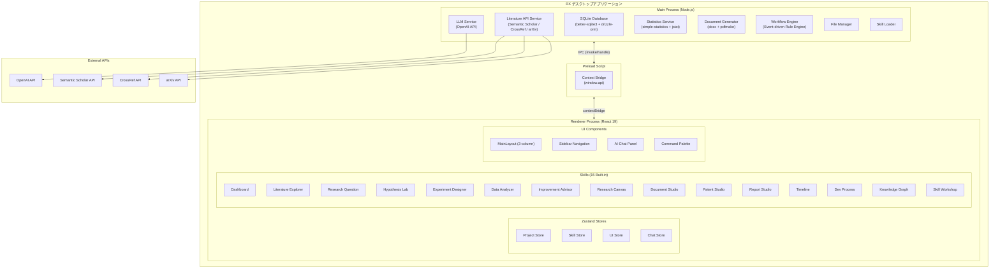

本図は、本発明に係る研究支援システム（RX）の全体アーキテクチャを示す。Electronフレームワークを基盤とし、Main Process、Preload Script、Renderer Processの3層構成を採用する。Main Processはデータベース、LLMサービス、文献API、統計計算、文書生成、ワークフローエンジンの各サービスを有する。Renderer Processは15個の組み込みスキルとUI コンポーネント群を有し、Zustandストアにより状態管理を行う。

### 【図2】 研究ライフサイクルフロー図

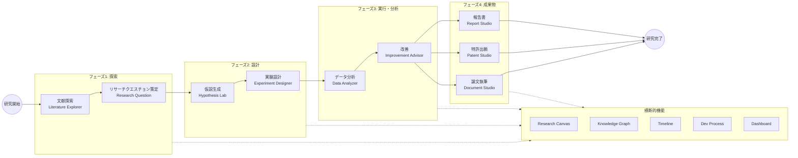

本図は、研究ライフサイクルにおける各フェーズとスキルの対応関係を示す。研究は探索フェーズから始まり、設計、実行・分析を経て成果物フェーズに至る。横断的機能（キャンバス、知識グラフ、タイムライン等）は全フェーズを通じて利用可能である。

### 【図3】 IPC通信シーケンス図

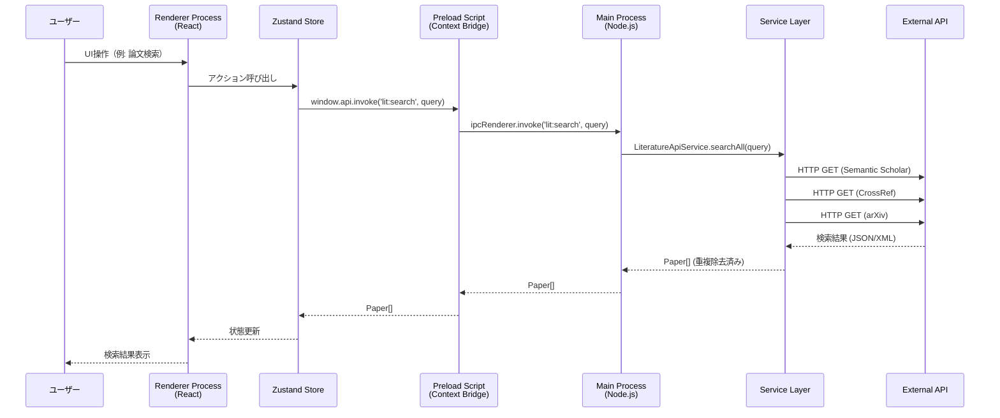

本図は、ユーザー操作からRenderer Process、Preload Script、Main Process、外部APIに至る通信シーケンスを示す。IPC通信はContext Bridgeを介して型安全に行われ、外部API呼び出しはService層で並列実行される。

### 【図4】 データベースER図

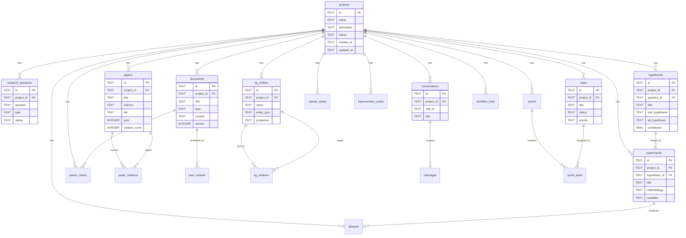

本図は、本システムにおけるデータベースのエンティティ関係を示す。projectsテーブルを中心として、研究活動に関する全データが関連付けられる。

### 【図5】 スキルシステムクラス図

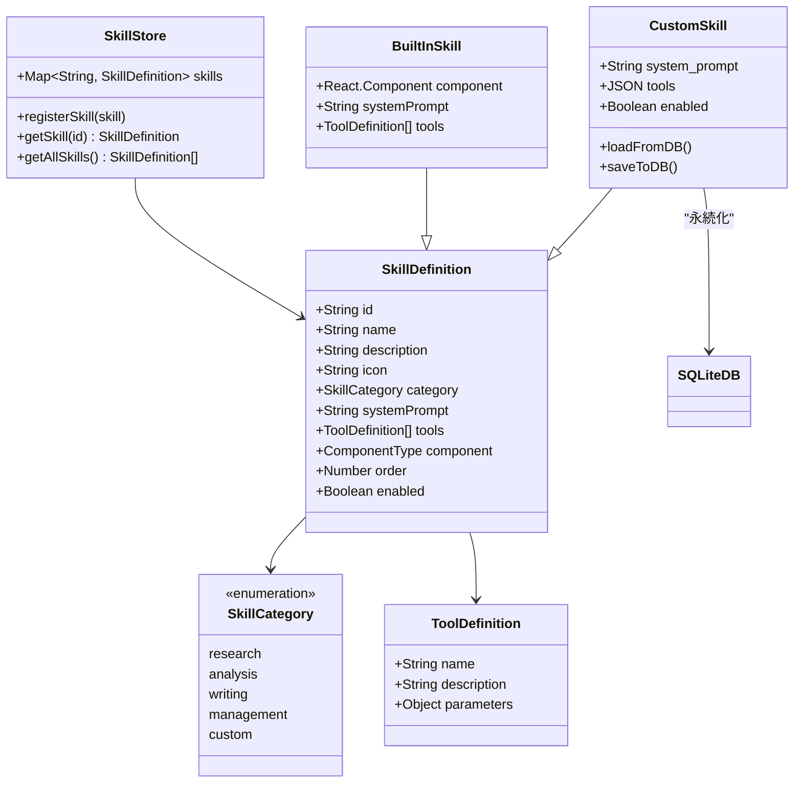

本図は、スキルシステムのクラス構成を示す。SkillDefinitionインターフェースを共通として、組み込みスキルとカスタムスキルが同一の機構で管理される。

### 【図6】 AI チャット処理フロー図

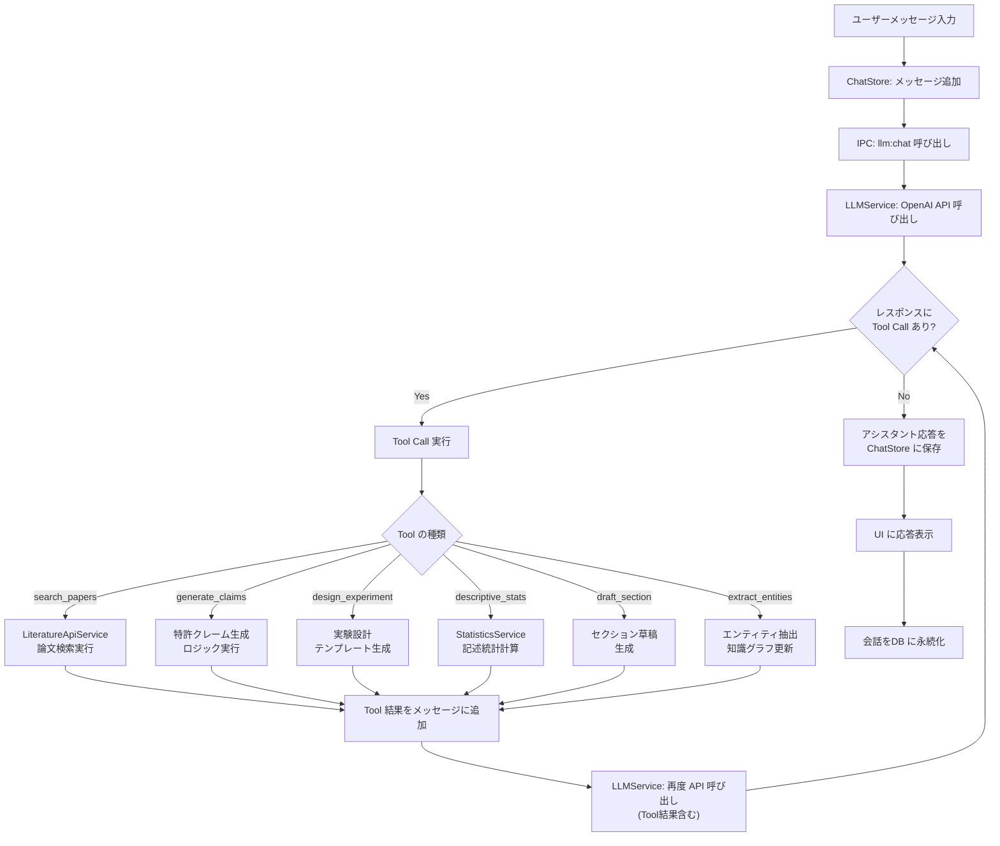

本図は、AIチャット処理におけるFunction Callingのフローを示す。ユーザーメッセージに対してLLMがTool Callを返した場合、該当するサービスでツールを実行し、結果を含めて再度LLMに問い合わせる。Tool Callがなくなるまでこのループを繰り返し、最終的なアシスタント応答をユーザーに提示する。

### 【図7】 3カラムUIレイアウト図

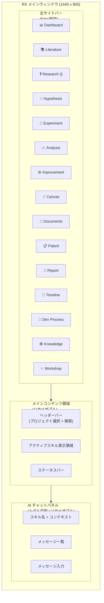

本図は、メインウィンドウの3カラムUIレイアウトを示す。左サイドバーには15個のスキルアイコンが縦に配置され、中央にはアクティブなスキルのコンテンツが表示され、右パネルにはAIチャットアシスタントが配置される。

### 【図8】 ワークフローエンジン状態遷移図

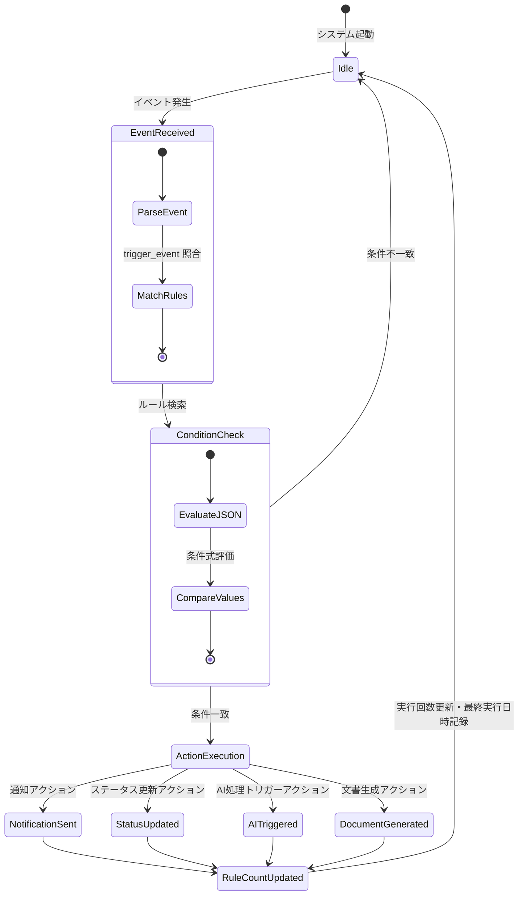

本図は、ワークフローエンジンの状態遷移を示す。イベント発生時にルールの条件を評価し、一致した場合にアクションを実行する。アクションには通知送信、ステータス更新、AI処理トリガー、文書生成等が含まれる。

---

## 17. 実施形態の詳細な説明

以下、図面を参照して、本発明の実施形態について詳細に説明する。

### 17.1 第1の実施形態: システム全体構成

#### 17.1.1 概要

図1を参照して、本発明の第1の実施形態に係る研究支援システム（以下「RXシステム」という）の全体構成について説明する。

RXシステムは、Electronフレームワークを基盤とするデスクトップアプリケーションとして実装される。Electronフレームワークは、Chromiumレンダリングエンジンと Node.js ランタイムを統合したクロスプラットフォームフレームワークであり、macOS、Windows、Linuxの各オペレーティングシステム上で動作可能である。

本システムは、Main Process（メインプロセス）、Preload Script（プリロードスクリプト）、Renderer Process（レンダラープロセス）の3つのプロセスから構成される。

#### 17.1.2 Main Process の構成

Main Processは、Node.js ランタイム上で動作し、以下の6つのサービスモジュールを有する。

**(a) データベースサービス（Database Service）**

SQLiteデータベースエンジン（better-sqlite3ライブラリ）と型安全ORM（drizzle-orm）を用いて、研究データの永続化を行う。データベースファイルは、OSのユーザーデータディレクトリ（macOSの場合は `~/Library/Application Support/rx/rx.db`）に保存される。WAL（Write-Ahead Logging）モードを有効化することにより、読み取りと書き込みの並行実行を可能とし、パフォーマンスの向上を図る。外部キー制約を有効化することにより、テーブル間の参照整合性を保証する。

データベースは20以上のテーブルを有し、プロジェクト（projects）テーブルを頂点として、リサーチクエスチョン（research_questions）、論文（papers）、仮説（hypotheses）、実験（experiments）、データセット（datasets）、文書（documents）、タスク（tasks）、会話（conversations）、知識グラフエンティティ（kg_entities）等の各テーブルが外部キーにより関連付けられる（図4参照）。

**(b) LLMサービス（LLM Service）**

OpenAI互換APIを介して大規模言語モデル（LLM）との連携を行うサービスである。シングルトンパターンで実装され、以下の4つのメソッドを提供する。

- `chat`: 通常のチャット補完。Function Calling（ツール呼び出し）に対応し、LLMがデータベース操作や文献検索等のツールを直接使用可能とする。
- `chatStream`: ストリーミングチャット補完。チャンク単位でコールバック関数を呼び出し、リアルタイムの応答表示を実現する。
- `structuredOutput`: JSON Schemaに基づく構造化出力。AIからの応答を型安全なオブジェクトとして取得する。温度パラメータを0.3に設定し、安定した構造化出力を得る。
- `listModels`: 利用可能なモデル一覧を取得する。gpt、o1、o3系のモデルをフィルタリングして返却する。

設定値（APIキー、ベースURL、デフォルトモデル等）はデータベースのsettingsテーブルに永続化され、アプリケーション再起動時にも保持される。エラーハンドリングとして、APIキー無効（401）、レート制限超過（429）、ネットワーク接続エラー（ENOTFOUND/ECONNREFUSED）に対する適切なエラーメッセージを提供する。

**(c) 文献APIサービス（Literature API Service）**

複数の学術データベースからの論文検索を統合的に行うサービスである。以下の4つのデータソースに対応する。

- **Semantic Scholar**: Graph API（`https://api.semanticscholar.org/graph/v1/`）を使用。3リクエスト/秒のレート制限付き。論文検索に加え、被引用論文・参考文献のグラフ探索機能を提供する。
- **CrossRef**: Works API（`https://api.crossref.org/works`）を使用。5リクエスト/秒のレート制限付き。DOIベースの論文メタデータ検索に特化する。
- **arXiv**: Query API（`https://export.arxiv.org/api/query`）を使用。1リクエスト/秒のレート制限付き。Atom XML形式のレスポンスをパースしてプレプリントの検索を行う。
- **PubMed**: 生物医学分野の文献検索インターフェースを提供する。

`searchAll`メソッドにより、上記4つのデータソースに対して並列に検索を実行し、DOIに基づく重複除去を行った上で統合結果を返却する。これにより、研究者は単一のインターフェースから複数のデータベースを横断的に検索可能となる。

**(d) 統計計算サービス（Statistics Service）**

`simple-statistics`および`jstat`ライブラリを用いた統計計算サービスである。以下の統計手法を提供する。

- **記述統計**: 平均、中央値、最頻値、標準偏差、分散、四分位数、歪度、尖度等の基本統計量の算出。
- **Welchのt検定**: 等分散を仮定しない独立2群の平均値比較。
- **対応のあるt検定**: 対応のある2群の平均値比較。
- **一元配置分散分析（ANOVA）**: F検定による3群以上の平均値比較。
- **カイ二乗検定**: カイ二乗適合度検定。
- **相関分析**: Pearsonの相関係数の算出（有意性検定および強度解釈付き）。
- **単回帰分析**: 傾き、切片、決定係数（R²）、残差、回帰方程式の算出。

**(e) 文書生成サービス（Document Generator）**

`docx`ライブラリおよび`pdfmake`ライブラリを用いて、DOCX形式およびPDF形式の文書を生成するサービスである。以下の5つのテンプレートに対応する。

- `paper-imrad`: IMRAD形式学術論文（Introduction, Methods, Results, Discussion）
- `patent-jp`: 日本特許明細書（技術分野、背景技術、発明の概要、課題、解決手段、効果、図面の簡単な説明、実施形態、特許請求の範囲、要約）
- `patent-us`: 米国特許明細書（Field, Background, Summary, Brief Description, Detailed Description, Claims, Abstract）
- `report-progress`: 進捗報告書
- `report-final`: 最終報告書

**(f) ワークフローエンジン（Workflow Engine）**

イベント駆動型のルールベースエンジンである（図8参照）。ワークフロールール（workflow_rulesテーブル）に定義されたトリガーイベント、条件、アクションに基づき、研究プロセスの自動化を実現する。例えば、「全ての実験が完了状態になった場合に、自動的に最終報告書のドラフトを生成する」といったルールを設定可能である。

#### 17.1.3 Preload Script の構成

Preload Scriptは、Main ProcessとRenderer Processの間の安全な通信橋渡しを行う。`contextBridge.exposeInMainWorld`メソッドにより、`window.api`オブジェクトをRenderer Processに公開する。セキュリティ上、`nodeIntegration`は`false`、`contextIsolation`は`true`に設定され、Renderer ProcessからNode.js APIへの直接アクセスを防止する。

公開されるIPCチャネルは、プロジェクト管理（`project:*`）、LLM通信（`llm:*`）、文献検索（`lit:*`）、スキル管理（`skill:*`）、設定（`settings:*`）、データベース（`db:*`）、ファイル操作（`file:*`）の7カテゴリに分類される。全てのチャネルは`ipcRenderer.invoke`/`ipcMain.handle`パターンで型安全に定義される。

#### 17.1.4 Renderer Process の構成

Renderer Processは、React 19をUIフレームワークとして使用し、TypeScriptによる型安全な開発を行う。Tailwind CSSによるユーティリティファーストのスタイリング、Radix UIによるアクセシブルなUIプリミティブを採用する。

状態管理にはZustandを使用し、以下の4つのストアを定義する。

- **ProjectStore**: プロジェクト一覧、現在選択中のプロジェクト、CRUD操作
- **SkillStore**: スキル登録、取得（組み込み + カスタム）
- **UIStore**: アクティブスキル、サイドバー状態、コマンドパレット表示
- **ChatStore**: 会話メッセージ、LLMインタラクション

### 17.2 第2の実施形態: スキルベースアーキテクチャ

#### 17.2.1 スキルの概念

図5を参照して、本発明の第2の実施形態に係るスキルベースアーキテクチャについて説明する。

本システムにおける「スキル」とは、研究ライフサイクルの特定フェーズに対応する機能モジュールであり、UI コンポーネント、AI システムプロンプト、およびツール定義の3要素から構成される。各スキルは`SkillDefinition`インターフェースに準拠し、SkillStoreに登録される。

スキルは「組み込みスキル（Built-in Skill）」と「カスタムスキル（Custom Skill）」の2種類に大別される。組み込みスキルは15個が標準で提供され、カスタムスキルはユーザーがSkill Workshopスキルを通じて追加作成可能である。カスタムスキルはSQLiteデータベースのskillsテーブルに永続化される。

#### 17.2.2 組み込みスキルの詳細

以下に、15個の組み込みスキルの詳細な機能を説明する。

**(1) Dashboard（ダッシュボード）**

プロジェクト全体の概要を表示するスキルである。プロジェクトの進捗状況、最近のアクティビティ、各スキルの使用状況をサマリー形式で提示する。ダッシュボードウィジェットにより、論文数、仮説数、実験進捗、タスク完了率等のKPIを可視化する。

**(2) Literature Explorer（文献探索）**

複数の学術データベースからの論文検索、引用グラフの可視化、システマティックレビューの支援を行うスキルである。AIツールとして`search_papers`（論文検索）、`summarize_paper`（論文要約）、`find_research_gaps`（研究ギャップ発見）を定義する。検索結果は@tanstack/react-tableを用いたデータテーブルに表示され、ソート、フィルタリング、ページネーション機能を提供する。論文のステータス管理（unread → reading → read → reviewed → archived）により、レビュープロセスを体系化する。

**(3) Research Question（リサーチクエスチョン）**

リサーチクエスチョン（RQ）の策定を支援するスキルである。PICO（Population, Intervention, Comparison, Outcome）、FINER（Feasible, Interesting, Novel, Ethical, Relevant）、SPIDER（Sample, Phenomenon of Interest, Design, Evaluation, Research type）、PEO（Population, Exposure, Outcome）の4つのフレームワークに対応する。AIツールとして`formulate_rq`（RQ策定）、`evaluate_rq`（RQ評価）を定義する。

**(4) Hypothesis Lab（仮説ラボ）**

AI支援による仮説生成・評価を行うスキルである。帰無仮説（H0）と対立仮説（H1）の策定、仮説の信頼度（0.0〜1.0）の評価を行う。AIツールとして`generate_hypotheses`（仮説生成）、`evaluate_hypothesis`（仮説評価）を定義する。仮説のステータス管理（proposed → testing → supported/rejected/revised）により、仮説検証プロセスを追跡する。

**(5) Experiment Designer（実験設計）**

実験の計画・設計を支援するスキルである。RCT（ランダム化比較試験）、準実験、観察研究、計算実験の各種設計に対応する。AIツールとして`design_experiment`（実験設計）、`select_statistical_test`（統計検定手法選択）を定義する。変数定義（独立変数、従属変数、制御変数、交絡変数）をJSON形式で管理し、実験プロトコルの構造化を行う。

**(6) Data Analyzer（データ分析）**

CSV/Excelデータのインポート、記述統計・推測統計の計算、データ可視化を行うスキルである。Rechartsライブラリを用いたグラフ（折れ線グラフ、棒グラフ、散布図、ヒストグラム等）の生成機能を有する。AIツールとして`recommend_method`（分析手法推薦）、`interpret_results`（結果解釈）を定義する。

**(7) Improvement Advisor（改善アドバイザー）**

PDCA（Plan-Do-Check-Act）サイクルに基づく研究改善、品質チェック、バイアス評価、ピアレビューシミュレーションを行うスキルである。AIツールとして`simulate_peer_review`（ピアレビューシミュレーション）、`suggest_improvements`（改善提案）を定義する。ピアレビューシミュレーションでは、方法論、統計、執筆、新規性の各観点からAIが文書を評価し、1〜10のスコアと詳細コメントを生成する。

**(8) Research Canvas（リサーチキャンバス）**

@xyflow/react（React Flow）ライブラリを用いた、ビジュアル概念マッピングスキルである。ノード（概念）とエッジ（関係）をドラッグ&ドロップで配置し、研究の全体像を視覚的に把握する。キャンバスの状態（ノード、エッジ、ビューポート）はcanvas_statesテーブルに永続化される。

**(9) Document Studio（ドキュメントスタジオ）**

TipTapリッチテキストエディタを用いた学術論文の執筆スキルである。IEEE、ACM、IMRAD、APAの各形式に対応するテンプレートを有する。KaTeXによる数式表示に対応し、LaTeX記法による数式の入力・表示が可能である。AIツールとして`draft_section`（セクション草稿生成）、`academic_tone`（学術的トーン調整）を定義する。

**(10) Patent Studio（特許スタジオ）**

特許明細書の作成を支援するスキルである。日本特許形式（技術分野、背景技術、発明の概要等）および米国特許形式（Field, Background, Summary等）に対応する。特許クレーム（patent_claimsテーブル）の管理機能を有し、独立クレームと従属クレームの階層構造を自己参照外部キーで管理する。AIツールとして`generate_claims`（クレーム生成）、`analyze_prior_art`（先行技術分析）を定義する。

**(11) Report Studio（レポートスタジオ）**

進捗報告書、最終報告書、技術報告書、研究提案書、助成金申請書の作成を支援するスキルである。AIツールとして`draft_report`（報告書草稿生成）を定義する。

**(12) Timeline（タイムライン）**

frappe-ganttライブラリを用いたガントチャート表示、マイルストーン管理、スケジュール最適化を行うスキルである。AIツールとして`generate_schedule`（スケジュール生成）、`identify_risks`（リスク識別）を定義する。

**(13) Dev Process（開発プロセス）**

DSR（Design Science Research）、Agile、Stage-Gateの各開発手法フレームワークに対応する。WBS（Work Breakdown Structure）の自動生成、スプリント管理（sprintsテーブル、sprint_tasksテーブル）を提供する。AIツールとして`generate_wbs`（WBS生成）、`recommend_framework`（フレームワーク推薦）を定義する。

**(14) Knowledge Graph（知識グラフ）**

研究ドメインにおけるエンティティ（概念、理論、手法、研究者等）とそれらの間のリレーション（is-a、part-of、causes、correlates等）を構造化して管理・可視化するスキルである。@xyflow/reactを用いたグラフ可視化機能を有する。AIツールとして`extract_entities`（エンティティ抽出）、`infer_relations`（関係推論）を定義する。エンティティはkg_entitiesテーブルに、リレーションはkg_relationsテーブルに保存され、重み付きの関係を管理可能である。

**(15) Skill Workshop（スキルワークショップ）**

カスタムスキルの作成、編集、管理を行うメタスキルである。ユーザーが独自のシステムプロンプトとツール定義を設定することにより、新しいスキルを作成可能である。作成されたカスタムスキルはskillsテーブルに保存され、組み込みスキルと同様にサイドバーに表示される。

### 17.3 第3の実施形態: AI連携機構

#### 17.3.1 Function Calling 機構

図6を参照して、本発明の第3の実施形態に係るAI連携機構について説明する。

本システムにおけるAI連携は、OpenAI API のFunction Calling機能を中核とする。各スキルは、そのスキルのコンテキストに適したツール定義（ToolDefinition）を持ち、これがLLMに対するFunction Callingの定義として使用される。

以下に、AIチャット処理の具体的なフローを説明する。

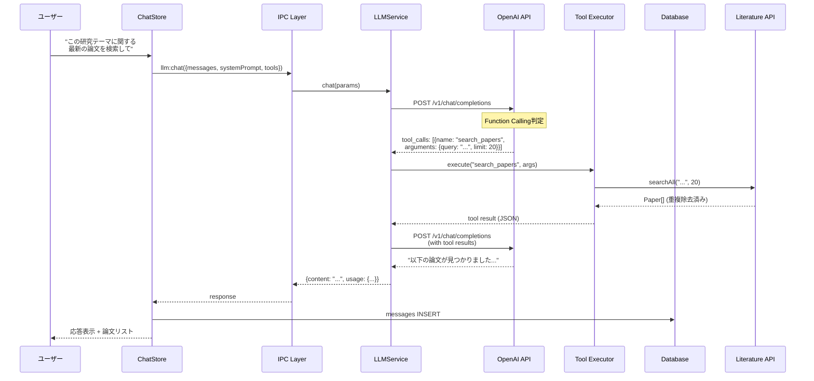

上記のシーケンスにおいて、ユーザーが「この研究テーマに関する最新の論文を検索して」と入力した場合、LLMは`search_papers`ツールの呼び出しを判断し、文献APIサービスを介して論文検索を実行する。検索結果はLLMに返却され、LLMが自然言語で結果を要約してユーザーに提示する。

#### 17.3.2 スキル別ツール定義の詳細

各スキルが定義するAIツールの入出力仕様を以下に示す。

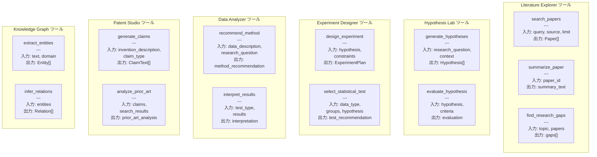

#### 17.3.3 構造化出力

LLMサービスの`structuredOutput`メソッドは、JSON Schemaに基づく構造化出力を提供する。これにより、AIの応答を型安全なオブジェクトとして取得することが可能となる。例えば、仮説生成ツールの出力は以下のJSON Schemaに準拠する。

```json
{
  "type": "object",
  "properties": {
    "hypotheses": {
      "type": "array",
      "items": {
        "type": "object",
        "properties": {
          "title": { "type": "string" },
          "description": { "type": "string" },
          "null_hypothesis": { "type": "string" },
          "alt_hypothesis": { "type": "string" },
          "confidence": { "type": "number", "minimum": 0, "maximum": 1 },
          "rationale": { "type": "string" }
        },
        "required": ["title", "null_hypothesis", "alt_hypothesis"]
      }
    }
  }
}
```

`json_schema`フォーマットに非対応のモデルを使用する場合は、`json_object`フォーマットにフォールバックする。

### 17.4 第4の実施形態: 知識グラフシステム

#### 17.4.1 知識グラフの構造

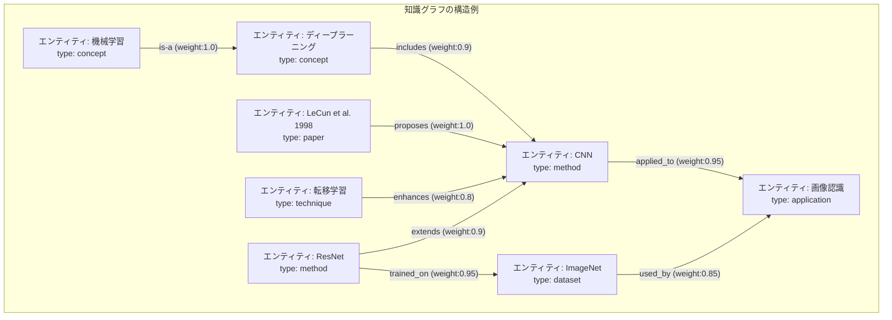

本図は、知識グラフシステムにおけるエンティティとリレーションの構造例を示す。各エンティティは名前（name）、種別（entity_type: concept, method, application, paper, technique, dataset等）、およびプロパティ（JSON形式）を持つ。リレーションは関係タイプ（relation_type）と重み（weight: 0.0〜1.0）を有し、概念間の関係の強さを定量的に表現する。

#### 17.4.2 エンティティ抽出と関係推論

AIツール`extract_entities`は、テキストからドメイン固有のエンティティを自動抽出する。`infer_relations`は、抽出されたエンティティ間の関係を推論する。以下にその処理フローを示す。

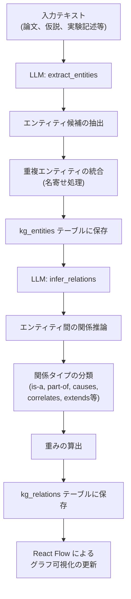

この処理フローにおいて、まずテキストからエンティティが抽出され、名寄せ処理により重複が排除される。次に、エンティティ間の関係が推論され、関係タイプの分類と重みの算出が行われる。結果はデータベースに保存されるとともに、React Flowによるグラフ表示が即座に更新される。

### 17.5 第5の実施形態: 文書生成システム

#### 17.5.1 テンプレートベースの文書生成

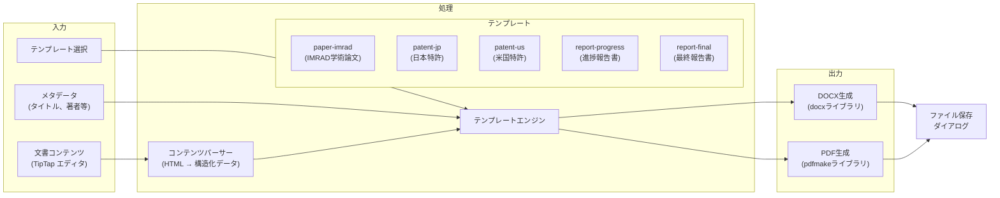

本図は、テンプレートベースの文書生成フローを示す。TipTapエディタで作成されたコンテンツは、HTMLからの構造化データに変換された後、選択されたテンプレートに基づいてDOCXまたはPDF形式のファイルとして出力される。

#### 17.5.2 日本特許明細書テンプレートの構成

日本特許明細書テンプレート（`patent-jp`）は、以下のセクション構成を有する。

1. **書類名**: 特許願
2. **発明の名称**
3. **技術分野**: 発明が属する技術分野の記述
4. **背景技術**: 従来技術とその課題
5. **発明の概要**:
   - 発明が解決しようとする課題
   - 課題を解決するための手段
   - 発明の効果
6. **図面の簡単な説明**: 各図面の内容説明
7. **発明を実施するための形態**: 実施形態の詳細な説明
8. **特許請求の範囲**: 独立クレームおよび従属クレーム
9. **要約書**: 発明の要約

### 17.6 第6の実施形態: UIシステム

#### 17.6.1 3カラムレイアウト

図7を参照して、本発明の第6の実施形態に係るUIシステムについて説明する。

メインウィンドウは3カラム構成を採用し、react-resizable-panelsライブラリによりユーザーが各カラムの幅を自由に調整可能である。

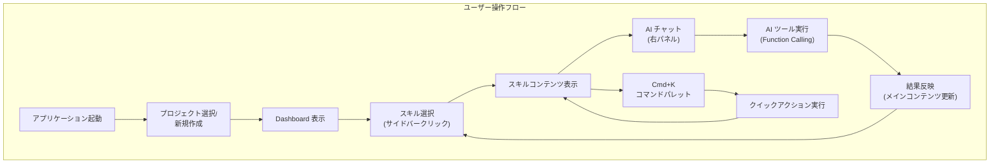

#### 17.6.2 コマンドパレット

`cmdk`ライブラリを用いたコマンドパレットは、`Cmd+K`（macOS）または`Ctrl+K`（Windows/Linux）のキーボードショートカットで呼び出される。以下のアクションをインクリメンタルサーチにより素早く実行可能である。

- スキル間の遷移
- プロジェクトの切り替え
- 論文の検索
- タスクの作成
- ドキュメントの新規作成
- 設定の変更

#### 17.6.3 テーマシステム

HSL変数ベースのライト/ダークモード対応を実装する。Tailwind CSSの`dark:`バリアントにより、全UIコンポーネントが両モードに対応する。テーマ設定はsettingsテーブルに永続化される。

### 17.7 第7の実施形態: 改善サイクルシステム

#### 17.7.1 PDCAサイクルに基づく研究改善

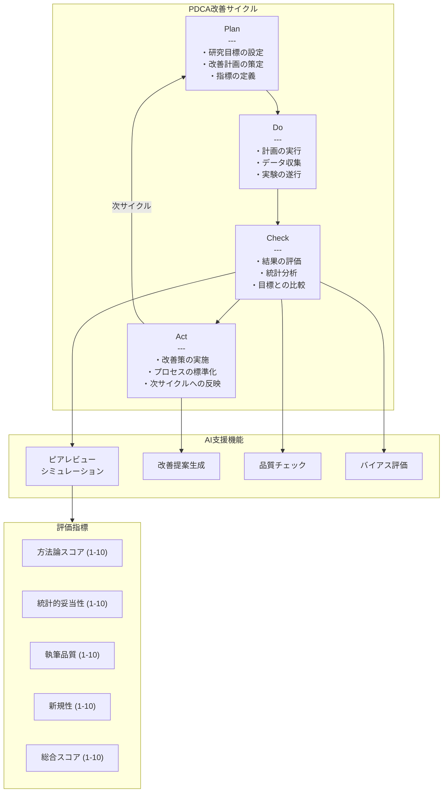

本図は、PDCAサイクルに基づく研究改善フローを示す。Checkフェーズにおいて、AIによるピアレビューシミュレーション、品質チェック、バイアス評価が実行され、方法論、統計的妥当性、執筆品質、新規性の各観点から1〜10のスコアが算出される。Actフェーズにおいて、AIが具体的な改善提案を生成する。

#### 17.7.2 ピアレビューシミュレーション

ピアレビューシミュレーション機能は、AIがバーチャルなレビューアとして文書を評価するものである。evaluation_cycles テーブルに改善サイクルの各フェーズが記録され、peer_reviews テーブルにレビュー結果が保存される。レビュー結果には、総合スコア、強み、弱み、提案、および詳細コメント（JSON配列）が含まれる。

### 17.8 第8の実施形態: データ分析パイプライン

#### 17.8.1 データインポートから可視化までのフロー

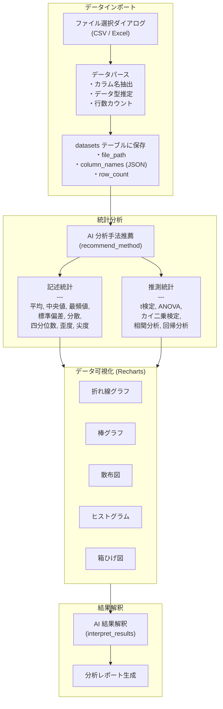

本図は、データ分析パイプラインの全体フローを示す。データのインポート、AI支援による分析手法の推薦、統計計算の実行、Rechartsによるデータ可視化、AI支援による結果解釈の一連のプロセスが統合されている。

### 17.9 第9の実施形態: 特許クレーム管理

#### 17.9.1 クレームの階層構造管理

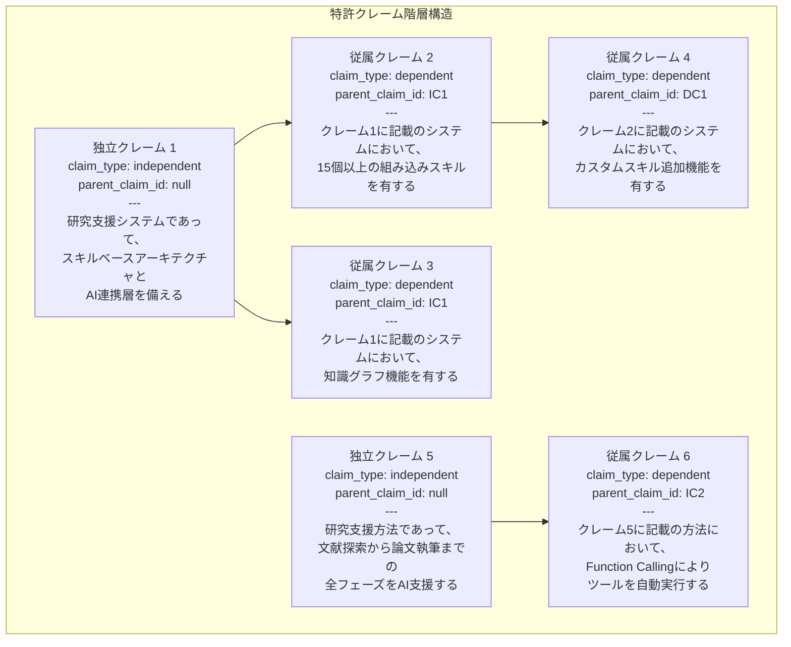

本図は、特許クレームの階層構造を示す。patent_claimsテーブルにおいて、`parent_claim_id`の自己参照外部キーにより、独立クレーム（independent）と従属クレーム（dependent）の親子関係を管理する。クレームのステータスは`draft` → `review` → `final` → `filed` → `granted`/`rejected`のライフサイクルで管理される。

---

## 18. 実施例

### 18.1 実施例1: 文献探索から仮説生成までの一連のワークフロー

以下に、ユーザーが新しい研究プロジェクトを開始し、文献探索から仮説生成に至るまでの具体的な操作例を示す。

**ステップ1: プロジェクト作成**

ユーザーがDashboardスキルにおいて「新規プロジェクト」ボタンをクリックし、プロジェクト名「深層学習を用いた医療画像診断の精度向上」を入力する。IPCチャネル`project:create`を介してprojectsテーブルに新規レコードが作成される。

**ステップ2: 文献探索**

Literature Explorerスキルに遷移し、検索クエリ「deep learning medical image diagnosis accuracy」を入力する。AIチャットパネルに「この研究テーマに関連する最新の論文を検索してください」と入力すると、AIが`search_papers`ツールを呼び出し、Semantic Scholar、CrossRef、arXivの3つのデータソースから並列に検索を実行する。DOIに基づく重複除去の後、統合結果がデータテーブルに表示される。ユーザーは各論文のステータスを「unread」から「reading」に変更しながらレビューを進める。

**ステップ3: リサーチクエスチョン策定**

Research Questionスキルに遷移し、PICOフレームワークを選択する。AIチャットパネルに「レビューした論文を基に、リサーチクエスチョンを策定してください」と入力すると、AIが`formulate_rq`ツールを呼び出し、以下のRQを提案する。

- P（Population）: 胸部X線画像のデータセット
- I（Intervention）: 転移学習を適用したCNNモデル
- C（Comparison）: 従来のCNNモデル（スクラッチ学習）
- O（Outcome）: 肺疾患検出の感度・特異度

策定されたRQはresearch_questionsテーブルに保存される。

**ステップ4: 仮説生成**

Hypothesis Labスキルに遷移し、AIチャットパネルに「上記のリサーチクエスチョンに基づいて仮説を生成してください」と入力する。AIが`generate_hypotheses`ツールを呼び出し、以下の仮説を生成する。

- H0（帰無仮説）: 転移学習を適用したCNNモデルと従来のCNNモデルの間で、肺疾患検出の感度に有意な差はない。
- H1（対立仮説）: 転移学習を適用したCNNモデルは、従来のCNNモデルと比較して、肺疾患検出の感度が有意に高い。
- 信頼度: 0.75

生成された仮説はhypothesesテーブルに保存され、関連するリサーチクエスチョンと外部キーで紐付けられる。

### 18.2 実施例2: 実験設計からデータ分析までの一連のワークフロー

**ステップ1: 実験設計**

Experiment Designerスキルにおいて、AIが`design_experiment`ツールを呼び出し、以下の実験計画を生成する。

- 実験タイプ: 計算実験（Computational Experiment）
- 独立変数: モデルアーキテクチャ（ResNet50転移学習 / VGG16転移学習 / CNN from scratch）
- 従属変数: 感度（Sensitivity）、特異度（Specificity）、AUC
- 制御変数: データセットサイズ、前処理方法、ハイパーパラメータ最適化手法
- サンプルサイズ: 5-fold交差検証 × 3モデル = 15試行

AIが`select_statistical_test`ツールを呼び出し、3群の比較にはANOVA（一元配置分散分析）を推薦し、事後検定にはTukey HSD法を推薦する。

**ステップ2: データ分析**

Data Analyzerスキルにおいて、実験結果のCSVファイルをインポートする。ファイル選択ダイアログ（`file:open-dialog`）により選択されたファイルがパースされ、datasetsテーブルに保存される。

AIが`recommend_method`ツールを呼び出し、データの性質（3群、連続変数、正規分布）から一元配置ANOVAを推薦する。StatisticsServiceの`anova`メソッドにより分析を実行し、以下の結果を得る。

- F値: 15.72
- p値: 0.0003
- 効果量（η²）: 0.72

AIが`interpret_results`ツールを呼び出し、「p < 0.001であり、3つのモデル間のAUCに統計的に有意な差が認められる。効果量η² = 0.72は大きな効果に分類される」と解釈を提供する。

結果はRechartsを用いた棒グラフおよび箱ひげ図で可視化される。

### 18.3 実施例3: 知識グラフの構築と活用

**ステップ1: エンティティ抽出**

Knowledge Graphスキルにおいて、レビュー済みの論文群からAIがエンティティを自動抽出する。「レビュー済み論文からエンティティを抽出して知識グラフを構築してください」と入力すると、AIが`extract_entities`ツールを呼び出し、以下のエンティティが抽出される。

| エンティティ名 | 種別 | 出典 |
|-------------|------|------|
| CNN | method | Paper #1, #3 |
| ResNet | method | Paper #2 |
| 転移学習 | technique | Paper #1, #2, #4 |
| 胸部X線画像 | dataset | Paper #1, #3 |
| 肺炎検出 | application | Paper #1, #5 |
| データ拡張 | technique | Paper #3 |

**ステップ2: 関係推論**

AIが`infer_relations`ツールを呼び出し、抽出されたエンティティ間の関係を推論する。

| ソース | 関係タイプ | ターゲット | 重み |
|--------|----------|----------|------|
| ResNet | extends | CNN | 0.95 |
| 転移学習 | enhances | ResNet | 0.85 |
| 転移学習 | enhances | CNN | 0.80 |
| CNN | applied_to | 肺炎検出 | 0.90 |
| 胸部X線画像 | input_to | CNN | 0.95 |
| データ拡張 | improves | CNN | 0.75 |

構築された知識グラフはReact Flowにより可視化され、ユーザーはノードの配置を自由に調整可能である。

### 18.4 実施例4: 特許明細書の作成

**ステップ1: クレーム生成**

Patent Studioスキルにおいて、AIチャットパネルに「本研究の成果を特許クレームとして策定してください」と入力する。AIが`generate_claims`ツールを呼び出し、以下のクレームを生成する。

**独立クレーム1**:
「胸部X線画像を入力として受け付ける画像入力部と、ImageNetで事前学習されたResNet50アーキテクチャに基づく特徴抽出部と、抽出された特徴量から肺疾患の有無を判定する判定部と、を備えることを特徴とする医療画像診断システム。」

**従属クレーム2**:
「請求項1に記載の医療画像診断システムにおいて、前記特徴抽出部は、事前学習された重みをファインチューニングする転移学習機構をさらに備えることを特徴とする医療画像診断システム。」

生成されたクレームはpatent_claimsテーブルに保存され、ステータスは「draft」に設定される。

**ステップ2: 先行技術分析**

AIが`analyze_prior_art`ツールを呼び出し、Literature Explorerで収集済みの論文群と生成されたクレームを照合し、先行技術との差分を分析する。分析結果はpatent_claimsテーブルのprior_art_notesカラムに保存される。

**ステップ3: 明細書生成**

Document Generatorサービスを用いて、`patent-jp`テンプレートに基づきDOCX形式の日本特許明細書を生成する。ファイル保存ダイアログ（`file:save-dialog`）により出力先を指定し、完成した明細書をエクスポートする。

### 18.5 実施例5: ワークフロー自動化

**ステップ1: ワークフロールールの定義**

以下のワークフロールールをworkflow_rulesテーブルに定義する。

```json
{
  "name": "実験完了時の自動通知",
  "trigger_event": "experiment:status_changed",
  "conditions": {
    "new_status": "completed",
    "all_experiments_completed": true
  },
  "actions": [
    {
      "type": "notification",
      "params": {
        "title": "全実験完了",
        "message": "全ての実験が完了しました。データ分析フェーズに進んでください。",
        "type": "success"
      }
    },
    {
      "type": "status_update",
      "params": {
        "entity_type": "project",
        "new_status": "analysis_phase"
      }
    }
  ]
}
```

**ステップ2: 自動実行**

ユーザーがExperiment Designerスキルにおいて最後の実験のステータスを「completed」に変更すると、ワークフローエンジンが`experiment:status_changed`イベントを検知する。条件「全ての実験が完了状態であるか」を評価し、条件が満たされた場合、通知の生成（notificationsテーブルへのINSERT）およびプロジェクトステータスの更新を自動的に実行する。

ルールの実行回数（execution_count）がインクリメントされ、最終実行日時（last_executed_at）が記録される。

---

## 19. 特許請求の範囲

### 請求項1

研究ライフサイクルの複数のフェーズに対応する複数の機能モジュールであるスキルを有し、各スキルがUI コンポーネント、AIシステムプロンプト、およびツール定義の3要素から構成されるスキルベースアーキテクチャと、
前記複数のスキルが使用するプロジェクト、論文、仮説、実験、データセット、文書等の研究データを一元的に管理するデータベースと、
大規模言語モデルとのFunction Calling機能により、前記データベースの操作、文献検索、統計計算等のツールをAIが直接使用可能とするAI連携層と、
を備えることを特徴とする研究支援システム。

### 請求項2

請求項1に記載の研究支援システムにおいて、
前記スキルは、文献探索、リサーチクエスチョン策定、仮説生成、実験設計、データ分析、改善アドバイザー、リサーチキャンバス、ドキュメントスタジオ、特許スタジオ、レポートスタジオ、タイムライン、開発プロセス、知識グラフ、およびスキルワークショップの15個の組み込みスキルを含む
ことを特徴とする研究支援システム。

### 請求項3

請求項1または2に記載の研究支援システムにおいて、
エンティティおよびリレーションの構造化された表現により研究ドメインにおける概念間の関係を管理し、AIによるエンティティ抽出および関係推論の機能を有する知識グラフシステムをさらに備える
ことを特徴とする研究支援システム。

### 請求項4

請求項1から3のいずれかに記載の研究支援システムにおいて、
イベント駆動型のルールベースエンジンにより、トリガーイベント、条件、およびアクションの定義に基づいて研究プロセスの自動化を行うワークフローエンジンをさらに備える
ことを特徴とする研究支援システム。

### 請求項5

請求項1から4のいずれかに記載の研究支援システムにおいて、
ユーザーが独自のシステムプロンプトとツール定義を設定することにより新しいスキルを作成可能なカスタムスキル機能を有する
ことを特徴とする研究支援システム。

### 請求項6

請求項1から5のいずれかに記載の研究支援システムにおいて、
前記AI連携層は、AIの応答をJSON Schemaに基づく構造化出力として取得する機能を有し、
json_schemaフォーマットに非対応のモデルを使用する場合にはjson_objectフォーマットにフォールバックする
ことを特徴とする研究支援システム。

### 請求項7

請求項1から6のいずれかに記載の研究支援システムにおいて、
PDCAサイクルに基づく改善サイクル管理と、AIによるピアレビューシミュレーション機能とを有し、
前記ピアレビューシミュレーションは、方法論、統計的妥当性、執筆品質、新規性の各観点から文書を評価してスコアおよびコメントを生成する
ことを特徴とする研究支援システム。

### 請求項8

コンピュータが実行する研究支援方法であって、
研究ライフサイクルの各フェーズに対応する複数のスキルモジュールのうち、ユーザーが選択したスキルを活性化するステップと、
活性化されたスキルに対応するAIシステムプロンプトおよびツール定義を用いて大規模言語モデルに問い合わせるステップと、
前記大規模言語モデルからのFunction Call応答に基づいて、文献検索、統計計算、データベース操作等のツールを自動実行するステップと、
ツール実行結果を前記大規模言語モデルに返却し、自然言語による応答を生成するステップと、
を含むことを特徴とする研究支援方法。

### 請求項9

請求項8に記載の研究支援方法において、
テキストからドメイン固有のエンティティを抽出するステップと、
抽出されたエンティティ間の関係を推論するステップと、
エンティティおよびリレーションを知識グラフとしてデータベースに保存するステップと、
知識グラフをグラフビジュアライゼーションにより可視化するステップと、
をさらに含むことを特徴とする研究支援方法。

### 請求項10

請求項8または9に記載の研究支援方法をコンピュータに実行させるためのプログラム。

---

## 20. 要約書

【課題】研究ライフサイクルの全フェーズにわたるAI支援の統合的提供と、プロジェクト単位での研究活動の一元管理を実現する研究支援システムを提供する。

【解決手段】本発明の研究支援システムは、研究ライフサイクルの各フェーズに対応する15個以上のスキルモジュールから成るスキルベースアーキテクチャと、プロジェクト・論文・仮説・実験・データセット・文書等の全研究データを一元管理するSQLiteデータベースと、OpenAI互換APIを介したFunction Calling機能によりAIがデータベース操作・文献検索・統計計算等のツールを直接使用可能とするAI連携層と、概念間の関係を可視化・推論する知識グラフシステムと、イベント駆動型のワークフローエンジンとを備える。各スキルはUIコンポーネント、AIシステムプロンプト、ツール定義の3要素から構成され、カスタムスキルの追加により拡張可能である。

【選択図】図1
